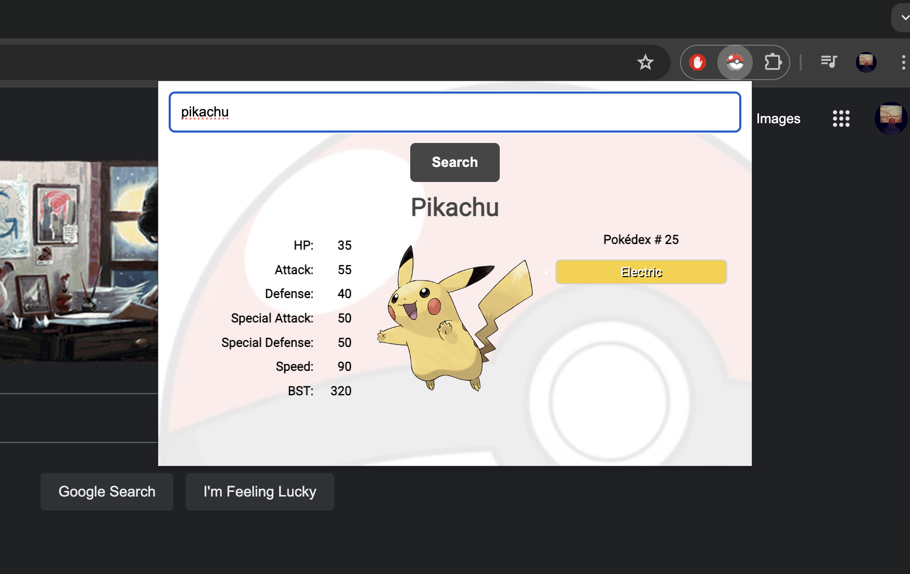

# Pokemon Search Tool

This tool will allow you to search for Pokemon using the PokeAPI.
A successful search will show you an image of the Pokemon, its
dynamically colored typing, and its stats, including its Base
Stat Total (BST).

This application is styled in such a way that it can easily be
added as a Chrome extension and used quite intuitively.

## Installation

Open index.html in any browser to search for your favorite Pokemon

OR, to make it into a Chrome Extension:

- Pull this directory to your machine
- Go to chrome://extensions/ in your Chrome browser
- Trigger "Developer Mode" in top right of screen
- Click "Load unpacked" on left side of screen
- Select the directory containing the Pokemon Search Tool files
- Open the tool via extensions, and Search Em All!

## Contributing

Pull requests are welcome. For major changes, please open an issue first
to discuss what you would like to change.

Special shoutout to freeCodeCamp.org and their JavaScript course on YouTube!
[freeCodeCamp](https://www.youtube.com/watch?v=jS4aFq5-91M&ab_channel=freeCodeCamp.org)

## License

[MIT](https://choosealicense.com/licenses/mit/)
